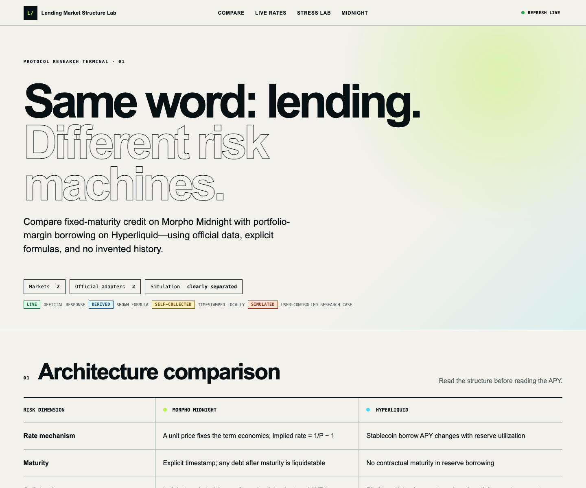

# Lending Market Structure Lab

A source-first portfolio project for comparing two lending systems that use the same vocabulary but create very different risks:

- **Morpho Midnight:** isolated, fixed-rate / fixed-maturity credit markets.
- **Hyperliquid:** variable-rate reserves connected to a shared Portfolio Margin account.

The dashboard reads current official APIs, records its own Hyperliquid observations to SQLite, derives only documented metrics, and marks every research scenario as simulated. Missing data stays **Unavailable**.



## What works

- Live Hyperliquid reserve cards from `POST https://api.hyperliquid.xyz/info` using `allBorrowLendReserveStates` and `spotMeta`.
- A SQLite collector that records timestamped reserve observations and exports validated chart data.
- Four history views: borrowing rate, utilization, borrowed liquidity, and rate vs utilization.
- Interactive Portfolio Margin stress lab showing how ETH perp PnL changes equity, borrow headroom, and a clearly labeled research liquidation buffer.
- Live Morpho Midnight books from `GET https://api.morpho.org/v0/midnight/books`.
- Midnight maturity countdown, unit price, implied term rate, simple annualized rate, raw secondary liquidity, collateral contracts, and LLTVs.
- Runtime validation with Zod, decimal-safe risk math, 18 unit tests, responsive layout, and visible provenance labels.

## Run locally

Requirements: Node.js 20.9+ and pnpm 10.

```bash
corepack enable pnpm
pnpm install
pnpm collect:hyperliquid -- --count 3 --interval-ms 1000
pnpm dev
```

Open `http://127.0.0.1:4173`.

Quality checks:

```bash
pnpm lint
pnpm typecheck
pnpm test
pnpm build
```

No RPC URL, private key, wallet secret, or API key is needed. `.env.example` documents that fact; `.env` files and the local SQLite database are ignored.

## Data provenance

| Label | Meaning |
| --- | --- |
| `LIVE` | Current response from an official public endpoint, validated at runtime. |
| `DERIVED` | Calculation from displayed official fields and a documented formula. |
| `SELF-COLLECTED` | A real API observation timestamped by this repository’s collector. Not protocol-provided history. |
| `SIMULATED` | User-controlled research scenario; never presented as account state. |
| `UNAVAILABLE` | The official response does not contain the required value. No proxy was substituted. |

The public Hyperliquid reserve response does not expose an observation or oracle timestamp. The UI therefore displays the client receipt time separately and explicitly says oracle time is unavailable.

## Architecture

```text
Official APIs
  ├─ Hyperliquid /info ── Zod ── live reserve snapshots
  │                          └── SQLite collector ── JSON export ── 4 charts
  └─ Morpho /v0/midnight/books ── Zod ── market + book snapshot

Validated snapshots ── pure Decimal.js math ── derived metrics
User inputs ── SIMULATED stress engine ── sensitivity table
```

The browser dashboard remains read-only. The collector is the only process that writes protocol observations, and it writes only to `data/hyperliquid-history.sqlite` plus the public JSON export.

## Variable-rate lending vs fixed-rate / fixed-maturity lending

```text
Variable-rate:
Borrower → reserve → utilization changes → floating borrow rate → open-ended debt

Fixed maturity:
Borrower → fixed-term market → unit price fixes term economics → maturity → repay/refinance
```

### How a variable rate changes

A variable-rate reserve reacts to supply and borrowing demand. Hyperliquid documents its stablecoin borrowing curve as:

```text
borrow APY = 5% + 475% × max(0, utilization − 80%)
utilization = total borrowed value / total supplied value
```

Below 80% utilization, this documented curve stays at 5%. Above that kink, the rate rises quickly. The borrower does not lock one final borrowing cost at entry; future utilization changes can change ongoing interest expense.

### How fixed borrowing cost is determined

Midnight trades units that settle one-for-one into loan tokens at maturity. If one debt unit is acquired for price `P`, its simple term rate is:

```text
term rate = 1 / P − 1
simple annualized rate = term rate × 365 / days remaining
```

The economics of those traded units are fixed by the execution price and maturity rather than by a continuously moving pool utilization rate. “Fixed” does not mean risk-free: entering or exiting still depends on the price and available order-book liquidity.

### Why maturity matters

Maturity is a hard time boundary. Before maturity, Midnight compares debt with `maxDebt = Σ(collateral value × LLTV)`. Strictly after maturity, the official docs state that any remaining debt is liquidatable regardless of pre-maturity collateral health. This creates repayment and refinancing deadlines that an open-ended Aave- or Morpho Blue-style loan normally does not have.

### Debt before and after maturity

- **Before maturity:** the position may remain open while its debt does not exceed maxDebt. Oracle movements can still make it unhealthy.
- **After maturity:** remaining debt becomes liquidatable under Midnight’s documented post-maturity rule. A previously healthy collateral ratio does not remove this deadline.

### Liquidity and refinancing risk

Midnight early exits require an opposite trade. A displayed fixed term is not the same as guaranteed exit liquidity. Near maturity, a borrower may need cash to repay or a new market willing to refinance. Thin bids/asks can turn an otherwise solvent position into a funding problem.

In Hyperliquid Portfolio Margin, open-ended borrowing removes a contractual maturity date, but market liquidity still matters when repaying debt or reducing perp exposure. A shared account can be forced to de-risk when positions lose money.

### Liquidation risk

- **Midnight:** isolated collateral values, LLTVs, debt, and maturity determine risk. Before maturity, debt above maxDebt is unhealthy; after maturity, any debt is liquidatable.
- **Hyperliquid:** the documented portfolio margin ratio combines portfolio balances, collateral liquidation thresholds, stablecoin borrowing and cross-position maintenance. Hyperliquid states that an account becomes liquidatable when this ratio exceeds `0.95`. Liquidation ordering can vary, so spot borrowing and perp exposure can affect each other.

The stress lab does **not** claim to reproduce a live account’s exact liquidation price. It uses official HYPE/BTC LTVs and liquidation thresholds, the first ETH maintenance tier, and the minimum borrow offset, while clearly excluding account-specific caps, oracle medians, tier deductions, and liquidation ordering.

### Oracle risk

Both designs depend on oracle values. A stale, manipulated, or temporarily divergent price can shrink borrowing capacity or trigger liquidations. Midnight’s market API exposes oracle contract addresses, but its book response does not expose the current oracle answer or timestamp; those fields are therefore shown as unavailable. Hyperliquid’s reserve response exposes `oraclePx` but not its observation timestamp.

### Why fixed maturity changes the risk structure

Aave and Morpho Blue debt is generally open-ended: the borrower manages a floating rate and health factor without one contractual repayment timestamp. Midnight replaces much of the floating-rate uncertainty with explicit term pricing, but adds deadline, refinancing, and secondary-liquidity risk. Hyperliquid adds a different dimension: shared Portfolio Margin lets capital work across spot borrowing and perps, but a loss in one position can consume the safety buffer of another.

## Official interfaces used

### Hyperliquid

- [Info endpoint](https://hyperliquid.gitbook.io/hyperliquid-docs/for-developers/api/info-endpoint): `allBorrowLendReserveStates`, `spotMeta`.
- [Portfolio Margin](https://hyperliquid.gitbook.io/hyperliquid-docs/trading/portfolio-margin): utilization curve, eligible collateral, LTVs, liquidation thresholds, margin formulas, and the `0.95` threshold.
- [Account abstraction modes](https://hyperliquid.gitbook.io/hyperliquid-docs/trading/account-abstraction-modes): Standard, Unified, and Portfolio Margin account structure.
- [Margin tiers](https://hyperliquid.gitbook.io/hyperliquid-docs/trading/margin-tiers): maintenance-margin tier convention used by the research simulator.

The official public pages reviewed here do not document a separate manual-borrow transaction action. The dashboard therefore does not fabricate one; it compares the documented Portfolio Margin behavior and reserve state.

### Morpho Midnight

- [Midnight API](https://docs.morpho.org/developers/api/morpho-midnight/): market and book schemas.
- [Collateral health and liquidations](https://docs.morpho.org/developers/midnight/concepts/collateral-health-liquidations/): maxDebt, pre-maturity health, and post-maturity liquidation.
- [Midnight concepts](https://docs.morpho.org/learn/concepts/midnight/): debt/credit units, price-derived term rate, maturity, and secondary liquidity.
- [Official SDK](https://github.com/morpho-org/sdks/tree/main/packages/midnight-sdk): viem-based Midnight package; not required by this read-only HTTP MVP.
- [Official contracts](https://github.com/morpho-org/midnight): canonical Solidity implementation and interfaces.

## Risk status convention

For normalized, pre-liquidation distance `(limit − debt) / limit`:

- `SAFE`: at least 20% remaining.
- `WARNING`: 5% to less than 20%.
- `CRITICAL`: 0% to less than 5%.
- `LIQUIDATABLE`: below 0%, or Midnight debt remaining strictly after maturity.

This is a UI convention for consistent comparison, not a claim that both protocols use these four names.

## Project structure

```text
src/
  components/           dashboard modules
  hooks/                resilient parallel data loading
  lib/data.ts           official adapters + Zod validation
  lib/risk.ts           pure Decimal.js calculations
  types.ts              unified LendingMarketSnapshot and provenance
scripts/
  collect-hyperliquid.ts
data/                   local SQLite location (database ignored)
public/data/             collected JSON chart export
docs/                    methodology, architecture, assumptions
screenshots/             desktop and mobile verification
```

## Limitations

1. Hyperliquid does not expose historical borrow/lend reserves through the official endpoint reviewed here. History begins only when this collector runs.
2. The public Midnight book response does not include a wallet position or oracle answer, so position collateral, debt, maxDebt and exact liquidation distance remain unavailable until a user/address adapter is added.
3. The stress engine is intentionally a transparent research projection, not the exchange’s full production risk engine.
4. The dashboard uses token units for Hyperliquid liquidity and raw integer asset amounts for Midnight where the current response does not include token decimals.
5. Browser access depends on the official APIs allowing the request; failures are surfaced as partial-data errors.

## Security

- Read-only public endpoints only.
- No signing, wallet connection, private keys, mnemonics, API secrets, or trade actions.
- Runtime schema validation rejects malformed responses.
- Large Midnight integers stay strings until Decimal.js calculations prevent unsafe IEEE-754 coercion.
- The collector database is local and ignored by Git; only the non-secret JSON observations used by the charts are committed.

See [methodology](docs/methodology.md), [architecture](docs/architecture.md), and [assumptions](docs/assumptions.md) for audit details.
